

# Anthony Karanja

**Full-Stack Developer** &nbsp;&middot;&nbsp; Software Engineer &nbsp;&middot;&nbsp; Founder, ALPHACODE SOLUTIONS

Kenya, Africa

<a href="https://anthonyke.netlify.app">Portfolio</a> &nbsp;&middot;&nbsp; <a href="https://www.linkedin.com/in/alphacodeke">LinkedIn</a> &nbsp;&middot;&nbsp; <a href="mailto:anthonykaranja018@gmail.com">Email</a> &nbsp;&middot;&nbsp; <a href="https://github.com/alphacodeke">GitHub</a>

 

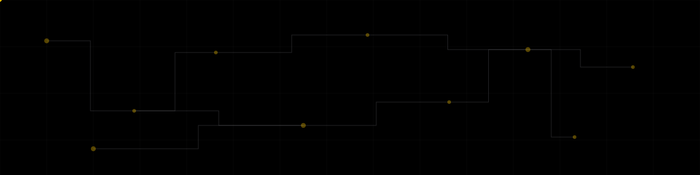

 

Building practical billing, payment, education, networking and business management systems around real operational workflows, from Kenya.

 

<h2 align="center">About</h2>

I build production-oriented systems for real operational problems: recurring billing, WiFi subscriber management, beauty-industry booking, student attendance, point of sale, financial record keeping, queue management, scholarship review, marketplaces, dairy operations and learning management. Most of these run on Django, MySQL and a JavaScript frontend, with the specific integrations, payments and background processing each system actually needs.

I work across the stack: schema design, business logic, API design, frontend behavior, deployment and security hardening. AI is one capability I apply where it genuinely fits a workflow, such as intelligent assistance inside a learning platform, not the center of what I build.

 

<h2 align="center">What I Build</h2>

<table width="100%">
<tbody>
<tr><td width="50%" valign="top"><strong>Business Systems</strong> Point of sale, inventory, customer records and reporting for day-to-day operations.</td><td width="50%" valign="top"><strong>Payments and Billing</strong> Recurring billing, invoicing, payment integrations and financial record keeping.</td></tr>
<tr><td width="50%" valign="top"><strong>Education Technology</strong> Attendance, scholarship workflows and learning management for schools and institutions.</td><td width="50%" valign="top"><strong>Networking</strong> Subscriber and billing systems that integrate with MikroTik network infrastructure.</td></tr>
<tr><td width="50%" valign="top"><strong>Marketplaces and Booking</strong> Buyer and seller platforms, and service booking for industries like beauty and wellness.</td><td width="50%" valign="top"><strong>Automation</strong> Queue management and workflow systems that replace manual, in-person processes.</td></tr>
</tbody>
</table>

 

<h2 align="center">Technology Stack</h2>

<table width="100%">
<tbody>
<tr><td colspan="2" align="center"><strong>FRONTEND</strong></td></tr>
<tr><td width="56"></td><td><strong>HTML5</strong> Structure and semantics for every interface</td></tr>
<tr><td width="56"></td><td><strong>CSS3</strong> Layout and visual styling</td></tr>
<tr><td width="56"></td><td><strong>JavaScript</strong> Client-side interactivity and dynamic behavior</td></tr>
<tr><td width="56"></td><td><strong>Tailwind CSS</strong> Utility-first styling compiled locally per project</td></tr>
<tr><td colspan="2" align="center"><strong>BACKEND</strong></td></tr>
<tr><td width="56"></td><td><strong>Python</strong> Application logic and backend services</td></tr>
<tr><td width="56"></td><td><strong>Django</strong> Primary web framework across production systems</td></tr>
<tr><td width="56"></td><td><strong>Django REST Framework</strong> API layer for client and integration access</td></tr>
<tr><td colspan="2" align="center"><strong>DATABASE</strong></td></tr>
<tr><td width="56"></td><td><strong>MySQL</strong> Primary relational database in production</td></tr>
<tr><td width="56"></td><td><strong>SQLite</strong> Local development database</td></tr>
<tr><td colspan="2" align="center"><strong>INFRASTRUCTURE</strong></td></tr>
<tr><td width="56"></td><td><strong>Linux</strong> Server operating environment</td></tr>
<tr><td width="56"></td><td><strong>Nginx</strong> Reverse proxy and static asset serving</td></tr>
<tr><td width="56"></td><td><strong>Gunicorn</strong> WSGI application server</td></tr>
<tr><td colspan="2" align="center"><strong>DEVELOPMENT</strong></td></tr>
<tr><td width="56"></td><td><strong>Git</strong> Version control</td></tr>
<tr><td width="56"></td><td><strong>GitHub</strong> Source hosting and collaboration</td></tr>
<tr><td width="56"></td><td><strong>VS Code</strong> Primary development environment</td></tr>
<tr><td colspan="2" align="center"><strong>INTEGRATIONS</strong></td></tr>
<tr><td width="56"></td><td><strong>Payment APIs</strong> Transaction processing across billing and commerce projects</td></tr>
<tr><td width="56"></td><td><strong>Email services</strong> Transactional and automated communication</td></tr>
<tr><td width="56"></td><td><strong>Webhooks</strong> Event-driven communication between systems</td></tr>
<tr><td width="56"></td><td><strong>MikroTik APIs</strong> Network device integration for WiFi billing</td></tr>
<tr><td colspan="2" align="center"><strong>ADDITIONAL TECHNOLOGIES</strong></td></tr>
<tr><td width="56"></td><td><strong>Redis</strong> Caching and background task queues</td></tr>
<tr><td width="56"></td><td><strong>WebSockets</strong> Real-time updates for live features</td></tr>
<tr><td width="56"></td><td><strong>PWA</strong> Offline-capable, installable web experiences</td></tr>
<tr><td width="56"></td><td><strong>Cloudflare Turnstile</strong> Bot protection on public forms</td></tr>
</tbody>
</table>

 

<h2 align="center">Product Ecosystem</h2>

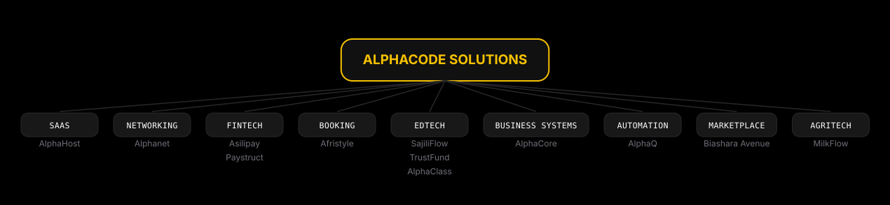

 

<h2 align="center">Featured Projects</h2>

<table width="100%">
<tr>
<td>

<h3 align="center">ALPHAHOST</h3>

SaaS Billing and Payment Collection Platform

<code>SAAS</code>&nbsp;&nbsp;<code>ACTIVE</code>

**The problem** 
Businesses managing recurring clients often rely on spreadsheets, manual reminders and fragmented payment tracking.

**The solution** 
AlphaHost centralizes recurring billing, invoicing, payment tracking, receipts, reminders and overdue payment workflows into one platform.

**Capabilities** 
`Recurring billing` `Flexible billing cycles` `Invoice generation` `Payment tracking` `Receipts` `Payment reminders` `Overdue notifications` `Dunning workflows` `Client dashboard` `Email automation`

**Stack** 
`Django` `MySQL` `JavaScript` `HTML5` `Tailwind CSS`

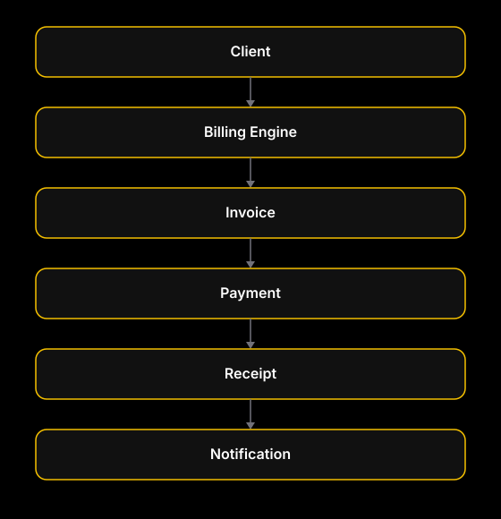

**Links:** Private repository

</td>
</tr>
</table>

<table width="100%">
<tr>
<td>

<h3 align="center">ALPHANET</h3>

MikroTik WiFi Billing System

<code>NETWORKING</code>&nbsp;&nbsp;<code>ACTIVE</code>

**The problem** 
Internet providers and network operators need a practical way to manage subscribers, packages and payments.

**The solution** 
A centralized WiFi billing and subscriber management platform designed to integrate with MikroTik infrastructure.

**Capabilities** 
`Subscriber management` `Packages` `Billing` `Payment integration` `MikroTik integration` `User management` `Administrative dashboards` `Network workflows`

**Stack** 
`Django` `MySQL` `JavaScript` `MikroTik API`

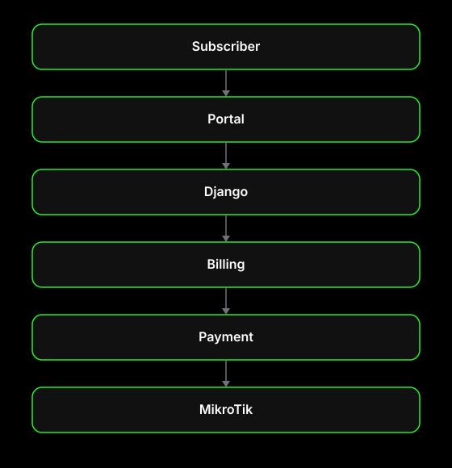

**Links:** Private repository

</td>
</tr>
</table>

<table width="100%">
<tr>
<td>

<h3 align="center">ASILIPAY</h3>

Payment Integration Infrastructure

<code>FINTECH</code>&nbsp;&nbsp;<code>ACTIVE</code>

**The problem** 
Businesses need a straightforward way to accept and reconcile digital payments without building integrations against every provider individually.

**The solution** 
Asilipay provides payment integration infrastructure that connects business systems to payment providers through a consistent API, handling transaction workflows and webhook notifications. It does not hold funds and is not a bank or payment processor in its own right.

**Capabilities** 
`Payment integrations` `Business payment collection` `Transaction workflows` `APIs` `Webhooks` `Payment notifications`

**Stack** 
`Django` `MySQL` `REST APIs` `Webhooks`

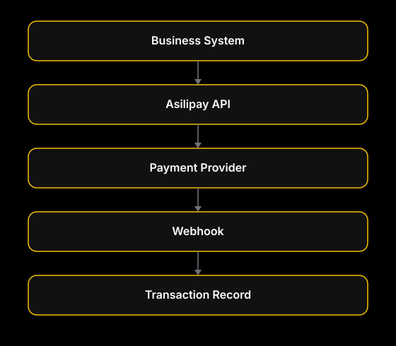

**Links:** Private repository

</td>
</tr>
</table>

<table width="100%">
<tr>
<td>

<h3 align="center">AFRISTYLE</h3>

Beauty Industry Booking Platform

<code>BOOKING</code>&nbsp;&nbsp;<code>ACTIVE</code>

**The problem** 
Many beauty businesses rely on manual booking processes, fragmented communication and poor scheduling workflows.

**The solution** 
A configurable platform where a beauty business can manage its services, categories, customers, staff and bookings from one system.

**Capabilities** 
`Service categories` `Services` `Booking` `Customer management` `Staff` `Business profile` `Payment integration` `Notifications` `Admin controls`

**Stack** 
`Django` `MySQL` `JavaScript` `Tailwind CSS`

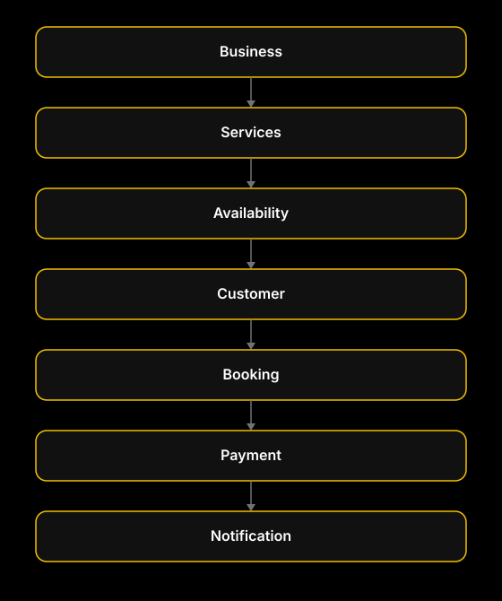

**Links:** Private repository

</td>
</tr>
</table>

<table width="100%">
<tr>
<td>

<h3 align="center">SAJILIFLOW</h3>

Student Attendance Management Platform

<code>EDTECH</code>&nbsp;&nbsp;<code>ACTIVE</code>

**The problem** 
Manual attendance is slow, difficult to verify and difficult to analyze.

**The solution** 
Digital attendance workflows using QR codes, location-aware verification, student profiles and automated communication.

**Capabilities** 
`QR attendance` `Lecturer sessions` `Student attendance` `Geofencing` `Email notifications` `Student profiles` `Verification` `PWA` `Offline functionality` `Administrative dashboard`

**Stack** 
`Django` `MySQL` `JavaScript` `PWA`

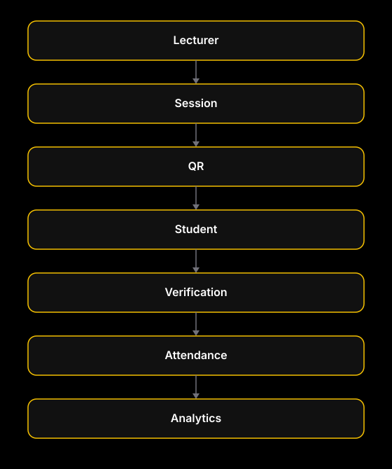

**Links:** Private repository

</td>
</tr>
</table>

<table width="100%">
<tr>
<td>

<h3 align="center">ALPHACORE</h3>

POS and Business Management System

<code>BUSINESS SYSTEMS</code>&nbsp;&nbsp;<code>ACTIVE</code>

**The problem** 
Small and medium businesses need sales, inventory and customer records handled in one consistent system instead of scattered tools.

**The solution** 
AlphaCore is a point-of-sale and business management system covering sales, inventory, customers and reporting from a single dashboard.

**Capabilities** 
`Sales` `Inventory` `Products` `Customers` `Transactions` `Reporting` `Dashboard` `Administration`

**Stack** 
`Django` `MySQL` `JavaScript`

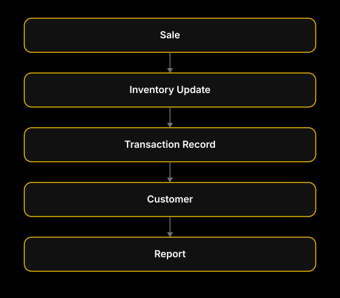

**Links:** Private repository

</td>
</tr>
</table>

<table width="100%">
<tr>
<td>

<h3 align="center">PAYSTRUCT</h3>

Financial Management System

<code>FINTECH</code>&nbsp;&nbsp;<code>ACTIVE</code>

**The problem** 
Organizations tracking accounts and financial records across manual processes struggle with consistency and oversight.

**The solution** 
Paystruct is a financial management system for account management, transaction records and administrative reporting. It is not a real bank and does not offer banking services.

**Capabilities** 
`Account management` `Transactions` `Financial records` `User management` `Administrative controls` `Reporting`

**Stack** 
`Django` `MySQL` `JavaScript`

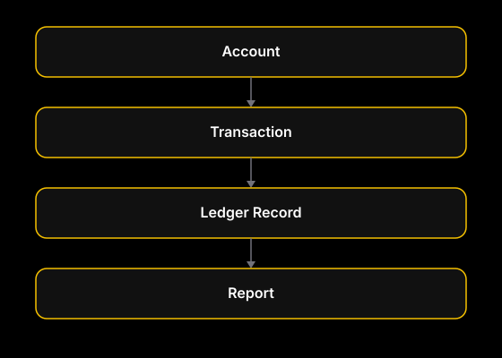

**Links:** Private repository

</td>
</tr>
</table>

<table width="100%">
<tr>
<td>

<h3 align="center">ALPHAQ</h3>

QR-Based Queue Management Platform

<code>AUTOMATION</code>&nbsp;&nbsp;<code>ACTIVE</code>

**The problem** 
Physical queues can create congestion, uncertainty and poor customer experiences.

**The solution** 
A digital queue system that allows customers and businesses to manage queue positions digitally.

**Capabilities** 
`QR access` `Queue creation` `Queue management` `Real-time updates` `Notifications` `Dashboard`

**Stack** 
`Django` `MySQL` `WebSockets` `JavaScript`

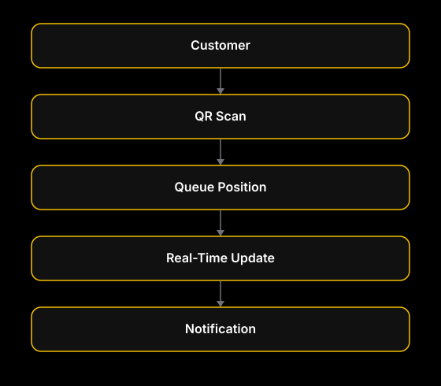

**Links:** Private repository

</td>
</tr>
</table>

<table width="100%">
<tr>
<td>

<h3 align="center">TRUSTFUND</h3>

Scholarship Workflow Management Platform

<code>EDTECH</code>&nbsp;&nbsp;<code>ACTIVE</code>

**The problem** 
Scholarship applications can become difficult to manage when handled through fragmented manual processes.

**The solution** 
Centralized scholarship application and review workflows.

**Capabilities** 
`Applications` `Applicants` `Review workflows` `Administrative management` `Notifications` `Records` `Reporting`

**Stack** 
`Django` `MySQL` `JavaScript`

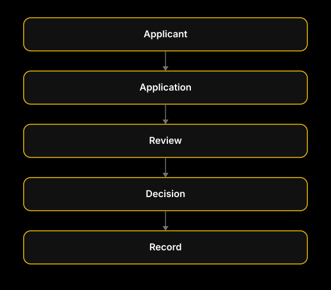

**Links:** Private repository

</td>
</tr>
</table>

<table width="100%">
<tr>
<td>

<h3 align="center">BIASHARA AVENUE</h3>

Marketplace Platform

<code>MARKETPLACE</code>&nbsp;&nbsp;<code>ACTIVE</code>

**The problem** 
Buyers and sellers need a centralized digital marketplace to discover products and manage transactions.

**The solution** 
A marketplace connecting buyers and sellers through product listings and marketplace workflows.

**Capabilities** 
`Sellers` `Buyers` `Products` `Listings` `Search` `Orders` `Marketplace administration`

**Stack** 
`Django` `MySQL` `JavaScript`

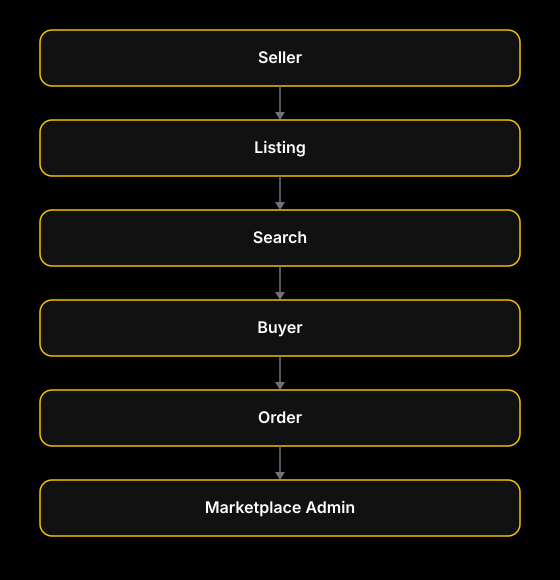

**Links:** Private repository

</td>
</tr>
</table>

<table width="100%">
<tr>
<td>

<h3 align="center">MILKFLOW</h3>

Dairy Management Platform

<code>AGRITECH</code>&nbsp;&nbsp;<code>ACTIVE</code>

**The problem** 
Dairy businesses need better visibility into production, collection, distribution and records.

**The solution** 
A digital management platform for dairy operations.

**Capabilities** 
`Production` `Milk collection` `Distribution` `Customers` `Records` `Reporting`

**Stack** 
`Django` `MySQL` `JavaScript`

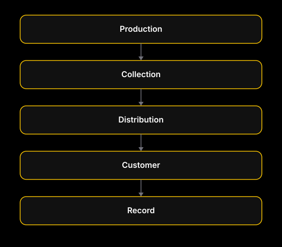

**Links:** Private repository

</td>
</tr>
</table>

<table width="100%">
<tr>
<td>

<h3 align="center">ALPHACLASS</h3>

Learning Management Platform

<code>EDTECH</code>&nbsp;&nbsp;<code>ACTIVE</code>

**The problem** 
Learning activities and educational resources can become fragmented across multiple systems.

**The solution** 
A centralized learning management environment for courses, instructors and student progress.

**Capabilities** 
`Courses` `Students` `Instructors` `Learning materials` `Assessments` `Progress` `Administration` `Intelligent assistance where applicable`

**Stack** 
`Django` `MySQL` `JavaScript`

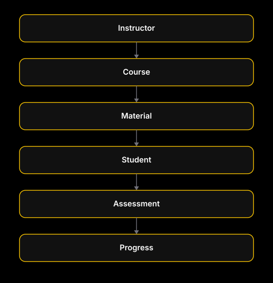

**Links:** Private repository

</td>
</tr>
</table>

 

<h2 align="center">Engineering Approach</h2>

A generalized view of how these systems are structured and built. Not every project uses every component below; this represents the pattern the stack is built around.

<h3 align="center">Architecture</h3>

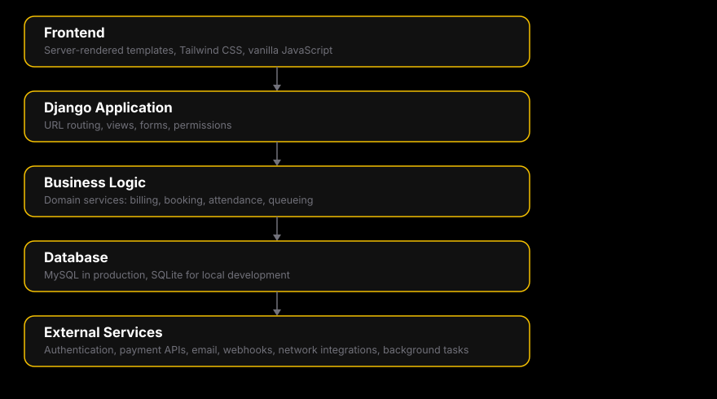

<h3 align="center">Workflow</h3>

 

<h2 align="center">Security</h2>

Security is treated as part of the engineering process, not an add-on.

- Authentication and authorization are enforced on every protected view and API endpoint, not assumed from the frontend.
- Input is validated on both the frontend and the backend; the backend validation is the one that is trusted.
- CSRF protection, secure session handling and password hashing follow the underlying framework's current defaults rather than custom implementations.
- Sensitive configuration, including database credentials and API keys, is kept in environment variables and never committed to source control.
- Traffic runs over HTTPS, with rate limiting and bot protection such as Cloudflare Turnstile applied to public-facing forms where appropriate.
- Errors are handled and logged deliberately, so failures are visible to the developer without exposing internals to the end user.

 

<h2 align="center">GitHub Activity</h2>

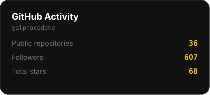
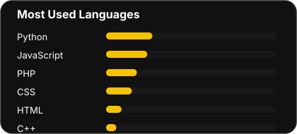

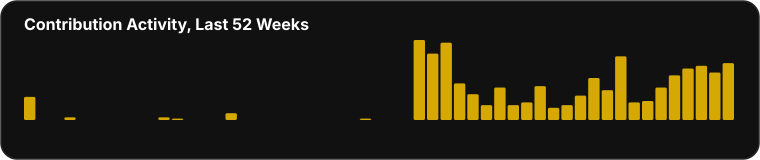

 

<h2 align="center">Connect</h2>

<a href="https://anthonyke.netlify.app">Portfolio</a> &nbsp;&middot;&nbsp; <a href="https://www.linkedin.com/in/alphacodeke">LinkedIn</a> &nbsp;&middot;&nbsp; <a href="mailto:anthonykaranja018@gmail.com">Email</a> &nbsp;&middot;&nbsp; <a href="https://github.com/alphacodeke">GitHub</a> &nbsp;&middot;&nbsp; <a href="https://anthonyke.netlify.app">ALPHACODE SOLUTIONS</a>

